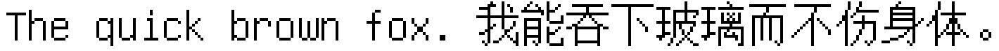
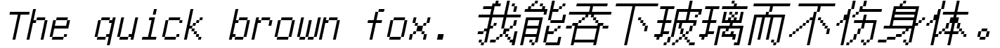
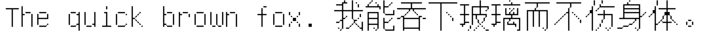

# Unifont Extbil

**Non-official Unifont derivative font** | Add bold/italic/light styles | **Alpha v0.001**

> ⚠️ **Important Notice**  
> This font is generated by automated tools, **not manually optimized**, for experimental and reference purposes only.  
> Non-official project, unrelated to the GNU Unifont team.

---

## ✨ Style Preview 
Regular (Base): 
 
Bold: 
 
Italic: 
 
Light: 
 

## 🚧Current Status: Alpha v0.001 
✅ Automated Generation of Basic Styles 
⚠️ Not Font Optimized (May Have Jaggies/Spacing Issues) 

## ❓ Feedback and Contributions
Please submit any issues or suggestions to the Issues page. 
Note: There is currently no automated process. 
 
## 🙏 Acknowledgment
- GNU Unifont Project [Paul Hardy](https://unifoundry.com/unifont/)
- FontCreator (High-Logic)
